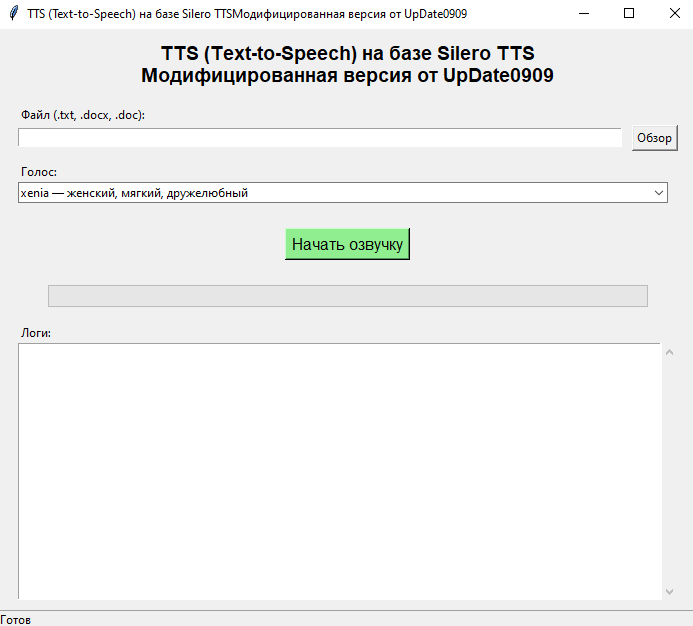

# 🎙️ TTS (Text-to-Speech) на базе Silero TTS

<div align="center">



**Модифицированная версия от UpDate0909**

[](https://opensource.org/licenses/MIT)
[](https://www.python.org/downloads/)
[](https://github.com/UpDate0909/TTS-Text-to-Speech-Silero-TTS/releases)

</div>

---

## 📖 Описание

Приложение для преобразования текста в речь с использованием нейросетевой модели [Silero TTS](https://github.com/snakers4/silero-models). Поддерживает чтение файлов в форматах `.txt`, `.docx`, `.doc` и генерацию аудио в формате MP3 с высоким качеством звука.

### ✨ Возможности

- 📄 **Поддержка форматов**: .txt, .docx, .doc
- 🎙️ **5 голосов на выбор**: мужские и женские голоса с разными характеристиками
- 🔊 **Высокое качество**: нейросетевой синтез речи Silero TTS v5
- 💾 **Экспорт в MP3**: автоматическая конвертация и склейка аудио
- 🖥️ **Удобный GUI**: простой и понятный графический интерфейс
- 📊 **Прогресс и логи**: отображение процесса обработки в реальном времени
- 🔄 **Автоматическая разбивка**: текст разбивается по предложениям для естественного звучания

---

## 🎭 Доступные голоса

| Голос | Пол | Характеристика |
|-------|-----|----------------|
| **aidar** | 👨 мужской | спокойный, чёткий |
| **baya** | 👩 женский | энергичный, яркий |
| **eugene** | 👨 мужской | глубокий, бархатистый |
| **kseniya** | 👩 женский | деловой, уверенный |
| **xenia** | 👩 женский | мягкий, дружелюбный |

---

## 🚀 Быстрый старт

### Вариант 1: Готовый .exe файл (Windows)

**Самый простой способ!** Не требует установки Python.

1. Скачайте готовый `.exe` файл из [Releases](https://github.com/UpDate0909/TTS-Text-to-Speech-Silero-TTS/releases)
2. Установите **ffmpeg** (см. инструкцию ниже)
3. Запустите `text_to_vois.exe`
4. Готово! 🎉

### Вариант 2: Запуск из исходного кода

Для разработчиков и пользователей Linux/macOS.

```bash
# 1. Клонируйте репозиторий
git clone https://github.com/UpDate0909/TTS-Text-to-Speech-Silero-TTS.git
cd TTS-Text-to-Speech-Silero-TTS

# 2. Установите зависимости
pip install -r requirements.txt

# 3. Запустите программу
python text_to_vois.py
```

---

## 🛠️ Подробная установка

### Шаг 1: Установка Python (если запускаете из исходного кода)

#### Windows:
1. Скачайте Python 3.8-3.12 с [python.org](https://www.python.org/downloads/)
2. **ВАЖНО**: При установке поставьте галочку **"Add Python to PATH"**
3. Проверьте установку:
   ```cmd
   python --version
   ```

#### Linux:
```bash
sudo apt update
sudo apt install python3 python3-pip
```

#### macOS:
```bash
brew install python@3.11
```

---

### Шаг 2: Установка ffmpeg (обязательно!)

**ffmpeg** нужен для конвертации аудио в MP3.

#### Windows:

**Способ 1 (рекомендуется):**
1. Скачайте ffmpeg: [https://www.gyan.dev/ffmpeg/builds/](https://www.gyan.dev/ffmpeg/builds/)
   - Выберите **"ffmpeg-release-essentials.zip"**
2. Распакуйте архив
3. Скопируйте папку `bin` в `C:\ffmpeg\bin\`
   - Должен получиться путь: `C:\ffmpeg\bin\ffmpeg.exe`
4. Добавьте в PATH:
   - Нажмите `Win + R`, введите `sysdm.cpl`
   - Вкладка **"Дополнительно"** → **"Переменные среды"**
   - В разделе **"Системные переменные"** найдите `Path` → **"Изменить"**
   - Нажмите **"Создать"** → введите `C:\ffmpeg\bin`
   - Нажмите **"ОК"** везде
5. Перезапустите командную строку и проверьте:
   ```cmd
   ffmpeg -version
   ```

**Способ 2 (через Chocolatey):**
```cmd
choco install ffmpeg
```

#### Linux:
```bash
sudo apt install ffmpeg
```

#### macOS:
```bash
brew install ffmpeg
```

---

### Шаг 3: Установка зависимостей Python

Откройте командную строку/терминал в папке проекта:

```bash
pip install -r requirements.txt
```

**Список устанавливаемых библиотек:**
- `torch` - PyTorch для работы с нейросетью
- `torchaudio` - обработка аудио
- `pydub` - конвертация аудио
- `soundfile` - сохранение WAV файлов
- `python-docx` - чтение .docx файлов
- `pywin32` - работа с Word (только Windows)
- `tqdm` - прогресс-бар
- `scipy` - научные вычисления

---

### Шаг 4: Установка Microsoft Word (опционально)

**Только для чтения .doc файлов!**

Если вы работаете только с `.txt` и `.docx`, Word не нужен.

- Windows: установите [Microsoft Office](https://www.microsoft.com/ru-ru/microsoft-365)
- Linux/macOS: используйте `.txt` или `.docx` форматы

---

## 📱 Использование

### Запуск программы

**Из .exe:**
```cmd
text_to_vois.exe
```

**Из исходного кода:**
```bash
python text_to_vois.py
```

### Работа с программой

1. **Выберите файл**
   - Нажмите кнопку **"Обзор"**
   - Выберите текстовый файл (`.txt`, `.docx`, `.doc`)

2. **Выберите голос**
   - Откройте выпадающий список
   - Выберите понравившийся голос

3. **Начните озвучку**
   - Нажмите **"Начать озвучку"**
   - Следите за прогрессом в окне логов

4. **Получите результат**
   - MP3 файл будет сохранён в той же папке, что и исходный файл
   - Формат имени: `имя_файла_голос_дата_время.mp3`
   - Пример: `Сказка_xenia_2025-11-12_15-30-45.mp3`

### Первый запуск

При первом запуске программа автоматически:
- Проверит наличие всех зависимостей
- Скачает модель Silero TTS (~100 МБ)
- Сохранит модель в кэш: `C:\Users\<Имя>\.cache\silero\`

**Это займёт 2-5 минут в зависимости от скорости интернета.**

---

## 🔧 Сборка .exe файла (для разработчиков)

Если вы хотите собрать свой .exe файл:

```bash
python -m PyInstaller --onefile --windowed --clean ^
  --hidden-import=torch ^
  --hidden-import=torchaudio ^
  --hidden-import=pydub ^
  --hidden-import=soundfile ^
  --hidden-import=docx ^
  --hidden-import=win32com.client ^
  --hidden-import=tqdm ^
  --hidden-import=tkinter ^
  --hidden-import=scipy ^
  text_to_vois.py
```

Готовый файл будет в папке `dist/text_to_vois.exe`

---

## 📁 Структура проекта

```
TTS-Text-to-Speech-Silero-TTS/
├── text_to_vois.py              # Основной скрипт
├── text_to_vois.spec            # Конфигурация PyInstaller
├── requirements.txt             # Зависимости Python
├── README.md                    # Документация
├── LICENSE                      # MIT лицензия
├── .gitignore                   # Игнорируемые файлы
├── screenshots/                 # Скриншоты для README
│   └── interface.png
└── dist/                        # Готовый .exe файл
    └── text_to_vois.exe
```

---

## 📋 Логирование

Программа создаёт файл `text_to_vois.log` в папке с программой.

**Лог содержит:**
- Информацию о запуске
- Проверку зависимостей
- Процесс обработки текста
- Ошибки (если возникли)

**Полезно для диагностики проблем!**

---

## ⚠️ Известные проблемы

### Python 3.13
В Python 3.13 удалён модуль `audioop`, что может вызвать проблемы с `pydub`.

**Решение:** используйте Python 3.8-3.12

### Чтение .doc файлов
Требуется установленный Microsoft Word (только Windows).

**Решение:** конвертируйте .doc в .docx или .txt

### ffmpeg не найден
Программа не запускается с ошибкой "ffmpeg не найден".

**Решение:** 
1. Проверьте установку: `ffmpeg -version`
2. Убедитесь, что ffmpeg добавлен в PATH
3. Перезапустите командную строку после добавления в PATH

---

## 🔍 Системные требования

### Минимальные:
- **ОС**: Windows 7/10/11, Linux, macOS
- **Python**: 3.8-3.12
- **RAM**: 2 ГБ
- **Диск**: 500 МБ свободного места (для модели и зависимостей)
- **Интернет**: для первой загрузки модели

### Рекомендуемые:
- **ОС**: Windows 10/11
- **Python**: 3.10-3.11
- **RAM**: 4 ГБ
- **Диск**: 1 ГБ свободного места

---

## 🛡️ Лицензия

Этот проект распространяется под лицензией **MIT License**.

Вы можете свободно:
- ✅ Использовать в коммерческих целях
- ✅ Модифицировать
- ✅ Распространять
- ✅ Использовать в частных проектах

См. файл [LICENSE](LICENSE) для подробностей.

---

## 🙏 Благодарности

Огромная благодарность команде **[Silero](https://github.com/snakers4/silero-models)** за создание отличной open-source модели синтеза речи!

### Используемые технологии:

- [Silero TTS](https://github.com/snakers4/silero-models) - нейросетевая модель синтеза речи
- [PyTorch](https://pytorch.org/) - фреймворк машинного обучения
- [pydub](https://github.com/jiaaro/pydub) - обработка аудио
- [python-docx](https://python-docx.readthedocs.io/) - чтение .docx файлов
- [pywin32](https://github.com/mhammond/pywin32) - работа с Word COM
- [tkinter](https://docs.python.org/3/library/tkinter.html) - графический интерфейс
- [ffmpeg](https://ffmpeg.org/) - конвертация аудио

---

## 📬 Контакты

**Автор:** UpDate0909

- 🌐 Сайт: [ewwo.ru](https://ewwo.ru)
- 💻 GitHub: [@UpDate0909](https://github.com/UpDate0909)

---

## 🔗 Полезные ссылки

- [Документация Silero TTS](https://github.com/snakers4/silero-models/blob/master/models/tts/README.md)
- [Скачать ffmpeg](https://www.gyan.dev/ffmpeg/builds/)
- [Скачать Python](https://www.python.org/downloads/)
- [Releases (готовые .exe)](https://github.com/UpDate0909/TTS-Text-to-Speech-Silero-TTS/releases)

---

<div align="center">

**Наслаждайтесь программой. Да прибудет с Вами сила!** ⚡

</div>
